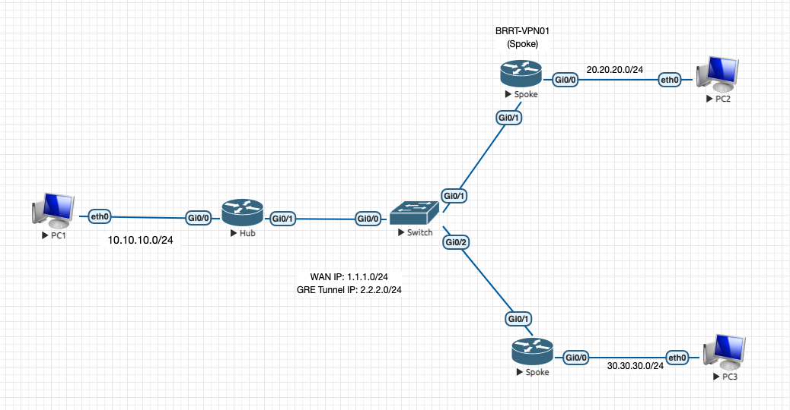

# Topology

# OSPF protocol
- Link State routing protocol 
- Every router has a map of the network, called a Link State Database
- OSPF runs the Dijkstra Algorithm to determine the shortest path
to network (priority: Bandwidth,..)
- Router share information(Link State Advertisments) into another router in an area -> Contructs a Link State Database (LSA) from received LSA. -> Run SPF to determine the shortest path to network. 

## OSPF Terminology
- **Hello**: a protocol used to discover OSPF neighbor and confirm reachability to those neighbors
- **Link State Advertisement(LSA)**: Information a router sends and receives about network reachability (used to construct a router's Link State Database)
- **Link State Update (LSU)**: A packte that carries LSAs
- **Link State Request (LSR)**: Used by a router to request LSA information from a neighbor
- **Link State Acknowledgement(LSAck)**: Used by a router to confirm it received an LSU
  
## Neighborship vs Adjacencies
- Neighbors are routers that:
  1. Reside on the same network link
  2. Exchange Hello messages
  3. Requirement:   
     1. Matching Area
     2. Matching Authen
     3. Matching Subnet
     4. Matching Timers
     5. Matching Stub Flags
     6. Matching MTU
- Adjacencies are routers that: 
  1. Are neighbors 
  2. Have exchanged LSUs,....

## Designated Routers:
- Only need 1 R for DR + 1 for BDR 
- DR and BDR Eletion:
  - Highest Router Priority Wins `ip ospf priority`
  - Highest Router ID Wins `router-id id`

## Area
- Recommend <= 15 router in 1 area 

# Step to do lab:
1. Config IP for PC1,2,3, Router 1,2,3
- PC1: `ip 10.10.10.10/24 10.10.10.1`
- PC2: `ip 20.20.20.10/24 20.20.20.1`
- PC3: `ip 30.30.30.10/24 30.30.30.1`
- Verify: `sh ip`
- Router 1(Hub-HQ): `hostname HQ`
  Config interface: 
  `int gig0/0`
  `no sh`
  `ip add 10.10.10.1 255.255.255.0`
  `int gig0/1`
  `no sh`
  `ip add 1.1.1.1 255.255.255.0`
- Router 2 (Spoke 1): `hostname Spoke1`
   `int gig0/0`
   `no sh`
   `ip add 20.20.20.1 255.255.255.0`
   `int gig0/1`
   `no sh`
   `ip add 1.1.1.2 255.255.255.0`
- Router 3 (Spoke 2): `hostname Spoke2`
  `int f0/0`
  `no sh`
  `ip add 30.30.30.1 255.255.255.0`
  `int f0/1`
  `no sh`
  `ip add 1.1.1.3 255.255.255.0`
- Verify: `sh int`
2. Config DMVPN for Router 
- Hub:
    - Create tunnel attach to gig0/1 and multipoint mode, set IP(GRE Tunnel IP: 2.2.2.0/24):
    `int tun 1`
    `tun mode gree multipoint`
    `ip add 2.2.2.1 255.255.255.0`
    - Create NHRP protocol for Spoke can query another Spoke:
    - Create NBMA network identifie: `ip nhrp network-id 1`
    - Allow multicast traffic for tunnel int: `ip nhrp map multicast dynamic`
    - Add OSPF type: `ip ospf network point-to-multipoint`
- Spoke1:
    - `int tun 1`
    - `tun source gig0/1`
    - `tun mode gre multipoint`
    - `ip add 2.2.2.2 255.255.255.0`
    - `ip nhrp network-id 1`
    - Register NHRP to HQ:
      - Allow multicast traffic to the Hub only: `ip nhrp map multicast 1.1.1.1`
      - Use MBNA address: `ip nhrp map 2.2.2.1 1.1.1.1`
      - Define next hop: `ip nhrp nhs 2.2.2.1`
    - Add the OSPF type: `ip ospf network point-to-multipoint`
- Spoke 2: 
  `int tun1
    des DPLC-ISP01
    ip add 2.2.2.3 255.255.255.0
    ip nhrp map 2.2.2.1 1.1.1.1
    ip nhrp map multicast 1.1.1.1
    ip nhrp network-id 1
    ip nhrp nhs 2.2.2.1
    ip ospf network point-to-multipoint
    tunnel source fa0/1
    tunnel mode gre multipoint`

- Verify: `sh ip ospf nei`

3. Config IPSec in 3 R

`# crypto isakmp policy 1
   authentication pre-share
   encryption 3des
   hash sha
   group 2
   lifetime 86400
   crypto isakmp key vpn@HQ2BR address 1.1.1.0 255.255.255.0    
   crypto ipsec transform-set HQ-TRSET01-AES256-SHA esp-aes 256 esp-sha-hmac # crypto ipsec profile PR-HQ-DMVPN
   set transform-set HQ-TRSET01-AES256-SHA
   int tun 1
   tunnel protection ipsec profile PR-HQ-DMVPN
`

4. Test and Verify the Configuration 

- In HQ: `sh ip int bri`
         `ping 2.2.2.2`
         `ping 2.2.2.3`
- Check if PC in HQ can ping PC in remote branch:
  `ping 20.20.20.10`
  `ping 30.30.30.10`
- Check OSPF routing protocol: `sh ip route ospf`
- Verify encrypt IPSEC: `sh crypto session detail`

